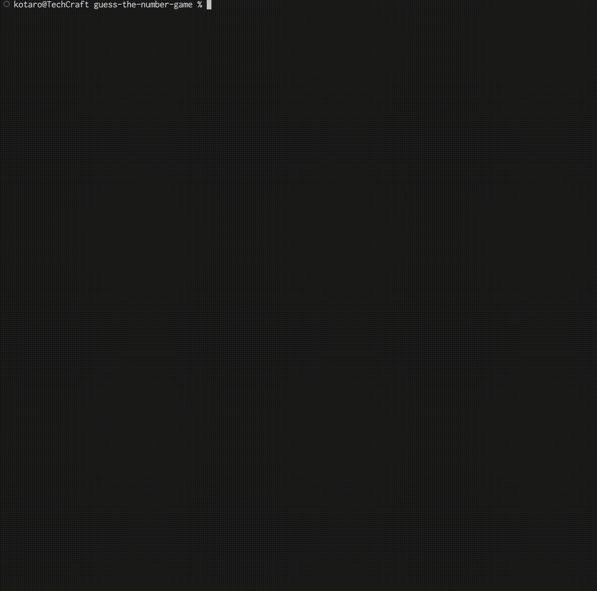

## シミュレーション


## 🎮 概要

このゲームは、設定した範囲の数字を当てるシンプルなPythonゲームです。


## 📥 必要な準備

Python 3.6以上がインストールされている必要があります。


## 🚀 実行方法

以下の手順で進めてください。

```bash
git clone https://github.com/ga-techcraft/guess-the-number-game.git
cd guess-the-number-game
python3 guess_the_number_game.py
```

## 🧑‍💻 遊び方
ゲームの説明に従い、最小値、最大値、試行回数を設定します。  
ランダムに選ばれた数字を当てるまで挑戦しましょう！  
正解すればクリア、回数を使い切るとゲームオーバーです。  
さあ、ぜひ挑戦してみてください！